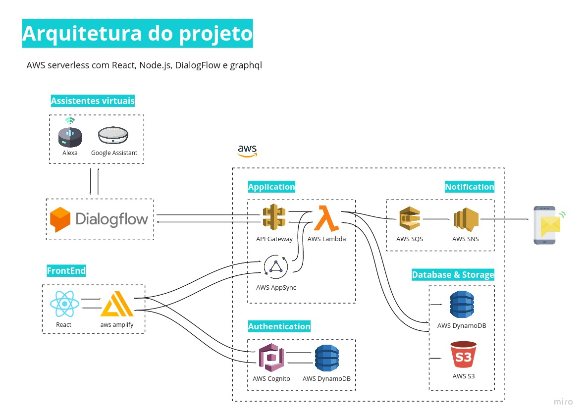

# rippo-frontend

Este repositório se destina aos códigos utlilizados na parte do front-end do projeto Rippo. O projeto tem por objetivo prover um sistema de acompanhamento da Asma.

## Arquitetura 🔨

A arquitetura do projeto na parte do front-end se da por um PWA construido em React ultilizando AWS amplify para se comunicar com api constuida no AppSync. A visão geral da arquitetura pode ser vista abaixo:



## Rodando 🔥🔥

A primeira coisa antes de rodar esse projeto é configuarar o arquivo de credencial do projeto, para isso você tem que criar um arquivo chamado ```aws-exports.js``` dentro das pasta src.

Esse arquivo deve ser editado da seguinte forma: 

```js
const awsmobile = {
    "aws_project_region": "<PROJECT REGION>",
    'aws_appsync_graphqlEndpoint': '<GRAPHQL API ENDPOINT>',
    'aws_appsync_authenticationType': 'API_KEY',
    'aws_appsync_apiKey': '<API KEY>',
};


export default awsmobile;

```

Pronto! agora o projeto ja está pronto para ser usado, basta abrir um terminal e na pasta raiz do projeto rodar o comando ```npm start``` e projeto ja vai executar.